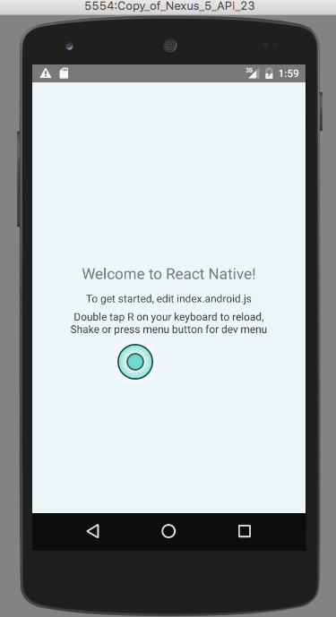

# Process Documentation

This document describes the process of creating a react-native android app from scratch, based on the official [Getting Started Guide](https://facebook.github.io/react-native/docs/getting-started.html).

Install node and node package dependencies:

```` sh
which node #> /usr/local/bin/node
brew install watchman
npm install -g react-native-cli
````

[Download](https://developer.android.com/studio/index.html) and [install](https://developer.android.com/studio/install.html) Android Studio.

Check JDK version:

```` sh
javac -version #> javac 1.7.0_80
````

Initialize a new react-native app:

```` sh
react-native init BeaconFinder
````

Try to run the app:

```` sh
cd BeaconFinder && react-native run-android
````

To overcome the error `SDK location not found. Define location with sdk.dir in the local.properties file or with an ANDROID_HOME environment variable.`:
 add to *~/.bash_profile*:

```` sh
export ANDROID_HOME="/Users/mjr/Library/Android/sdk"
````

Try to run the app again:

```` sh
react-native run-android
````

To overcome the error `failed to find target with hash string 'android-23' in: /Users/mjr/Library/Android/sdk`:

  + open Android Studio
  + navigate to *Tools* > *Android* > *SDK Manager*
  + then under the *SDK Platforms* tab, check the box for *Android 6.0 (Marshmellow) - API level 23*
  + then click *OK* to initiate a download of that version

You should see a new folder at */Users/mjr/Library/Android/sdk/platforms/android-23*.

Try to run the app again:

```` sh
react-native run-android
````

To overcome the error `failed to find Build Tools revision 23.0.1`:

  + open Android Studio
  + navigate to *Tools* > *Android* > *SDK Manager*
  + then under the *SDK Tools* tab, check the *Show Package Details* box in the bottom right-hand corner.
  + expand the Android SDK Build Tools line to reveal numerous versions of the build tools that can be downloaded. some say they are obsolete.
  + check the box for *Android SDK Build Tools 23.0.1*
  + then click *Apply* to initiate a download of that version of the build tools

You should see a new folder at */Users/mjr/Library/Android/sdk/build-tools/23.0.1*.

Try to run the app again:

```` sh
react-native run-android
````

To overcome the error `Execution failed for task ':app:installDebug'... com.android.builder.testing.api.DeviceException: No connected devices!`:

> based on https://developer.android.com/studio/run/managing-avds.html#createavd and https://developer.android.com/studio/run/managing-avds.html#emulator

  + open Android Studio
  + navigate to *Tools* > *Android* > *AVD Manager*
  + click *Create a Virtual Device*
  + choose the type of device to create - *Nexus 5*
  + choose a release and download it - *Marshmellow - 23 - x86*
  + when the download finishes, select the release and click *Next*
  + click *Finish*
  + click on *Duplicate* from the recently-created AVD's dropdown menu, and click *Finish* to copy the AVD
  + click the copied AVD's *Run/play* button to launch this AVD in an emulator

Try to run the app again:

```` sh
react-native run-android
````

SUCCESS!


